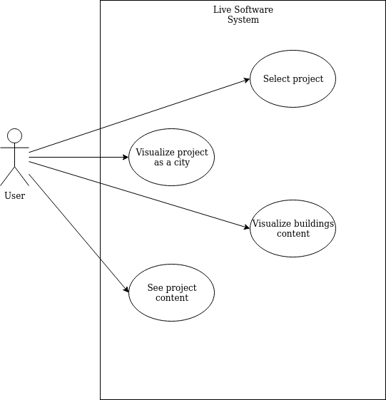
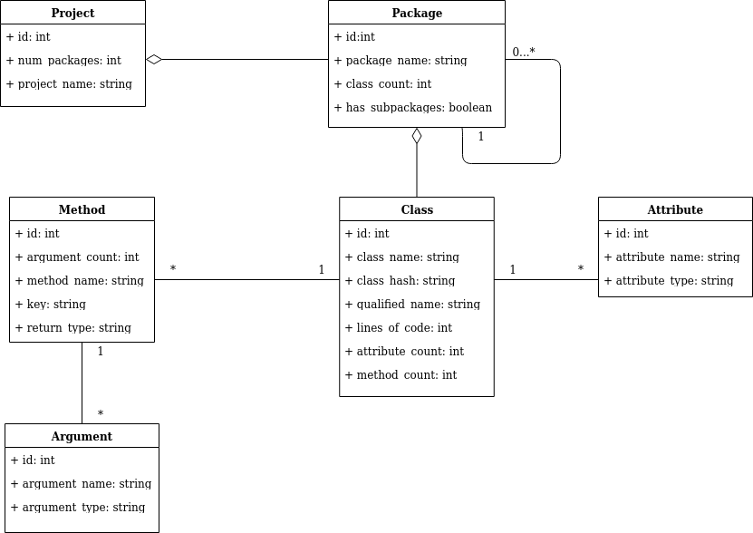

# live-software Development Report

Welcome to the live-software!

You can find here detailed about the (sub)product, hereby mentioned as module, from a high-level vision to low-level implementation decisions, a kind of Software Development Report (see [template](https://github.com/softeng-feup/open-cx/blob/master/docs/templates/Development-Report.md)), organized by discipline (as of RUP): 

* Business modeling 
  * [Product Vision](#Product-Vision)
  * [Elevator Pitch](#Elevator-Pitch)
* Requirements
  * [Use Case Diagram](#Use-case-diagram)
  * [Domain model](#Domain-model)
* Architecture and Design
  * [Logical architecture](#Logical-architecture)
  * [Physical architecture](#Physical-architecture)
* [Implementation](#Implementation)

So far, contributions are exclusively made by the initial team, but we hope to open them to the community, in all areas and topics: requirements, technologies, development, experimentation, testing, etc.

Please contact us! 

Thank you!

*José Pedro (j.pedroteixeira.monteiro@gmail.com)*

---

## Product Vision

Any software system that has a considerable growing number of features will suffer from essential complexity, which makes the understanding of the software artifacts increasingly costly and time-consuming. A common approach for reducing the software understanding complexity is to use software visualizations techniques. This projects presents a novel approach to tackle the software complexity, delving into the common approaches for extracting information about software artifacts and common software visualization metaphors, allowing users to dive into the software system.

---
## Elevator Pitch

With the increase of software complexity new approaches are taken to visualize it's content in a more easy and understandable way. In this project, we focus on the specific format of object-oriented languages, using a **city** as a metaphor, considering that the packages are districts and classes are buildings. In this way, we can position all the components with a layout that will help users to understand the software structure and behaviour.

| Project | City     |
|---------|----------|
| Package | District |
| Class   | Building |

### Use case diagram 

 

### Domain model

---

## Architecture and Design

The project uses **npm** and **react**. With this frameworks we simply the process of setup the project and also, both are trending so it makes it easy to someone contribute to the project. As a visualization lib, we use **Three.js**. This is built on top of **WebGL**, being a powerfull but lighweight library. Our system aims to interact with a exposed API, named [repository](https://github.com/dominguesgm/live-software-repository), which will contain the projects information and data to interact with our platform.

Following the description above, we decomponsed the project structure in the following way:

* **api**: Code that will interact with the **repository**-
* **components**: React components.
* **objects**: Code with the live software logic, city, districts and classes.
* **views**: Diffent we views of the website.

We decoupled the logic part with the visualization, as well the api interaction, in order to make it flexible to change the api which our platform interacts with. With this, we just need to grant that the middleware between the api response and the logic construction, parses the data to the structure required in our logic.

---

## Evolution - contributions to open-cx

Many different approaches are being taken to evolve the way we visualize software. This projects aims to contribute to the live software development community and motivate new studies applied in different contexts, e.g., visualization of functional languages, physical architectures, etc.
